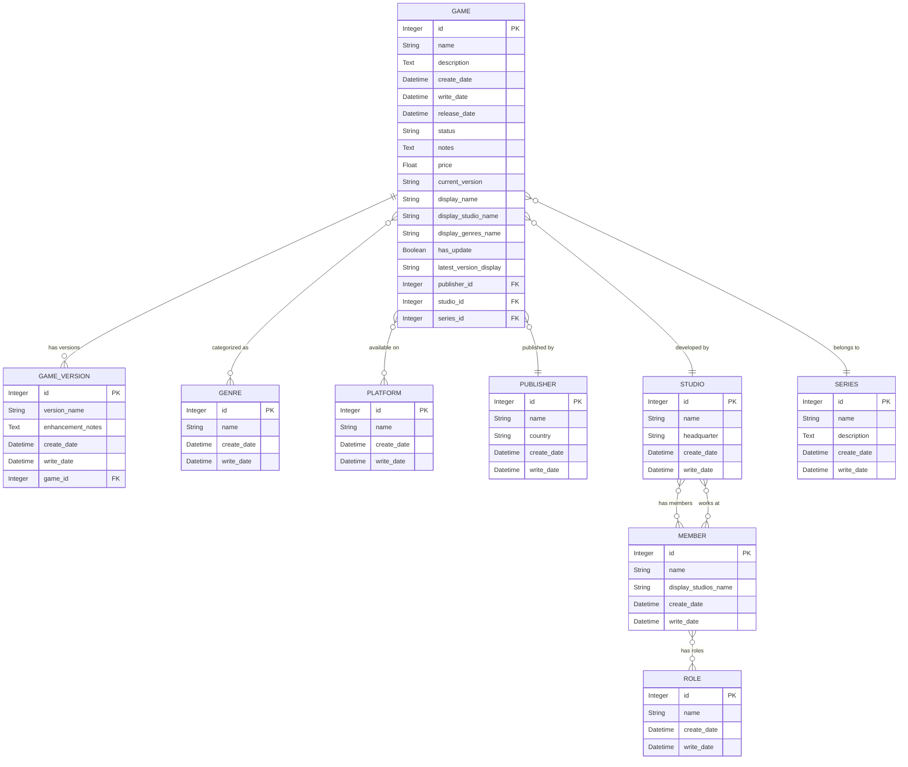

```mermaid
erDiagram

    %% =========================
    %% GAME
    %% =========================

    GAME {
        Integer id PK
        String name
        Text description
        Datetime create_date
        Datetime write_date
        Datetime release_date
        String status
        Text notes
        Float price
        String current_version
        String display_name
        String display_studio_name
        String display_genres_name
        Boolean has_update
        String latest_version_display
        Integer publisher_id FK
        Integer studio_id FK
        Integer series_id FK
    }

    GAME ||--o{ GAME_VERSION : "has versions"
    GAME }o--o{ GENRE : "categorized as"
    GAME }o--o{ PLATFORM : "available on"
    GAME }o--|| PUBLISHER : "published by"
    GAME }o--|| STUDIO : "developed by"
    GAME }o--|| SERIES : "belongs to"

    %% =========================
    %% GAME VERSION
    %% =========================

    GAME_VERSION {
        Integer id PK
        String version_name
        Text enhancement_notes
        Datetime create_date
        Datetime write_date
        Integer game_id FK
    }

    %% =========================
    %% SERIES
    %% =========================

    SERIES {
        Integer id PK
        String name
        Text description
        Datetime create_date
        Datetime write_date
    }

    %% =========================
    %% PUBLISHER
    %% =========================

    PUBLISHER {
        Integer id PK
        String name
        String country
        Datetime create_date
        Datetime write_date
    }

    %% =========================
    %% STUDIO
    %% =========================

    STUDIO {
        Integer id PK
        String name
        String headquarter
        Datetime create_date
        Datetime write_date
    }

    STUDIO }o--o{ MEMBER : "has members"

    %% =========================
    %% MEMBER
    %% =========================

    MEMBER {
        Integer id PK
        String name
        String display_studios_name
        Datetime create_date
        Datetime write_date
    }

    MEMBER }o--o{ ROLE : "has roles"
    MEMBER }o--o{ STUDIO : "works at"

    %% =========================
    %% ROLE
    %% =========================

    ROLE {
        Integer id PK
        String name
        Datetime create_date
        Datetime write_date
    }

    %% =========================
    %% GENRE
    %% =========================

    GENRE {
        Integer id PK
        String name
        Datetime create_date
        Datetime write_date
    }

    %% =========================
    %% PLATFORM
    %% =========================

    PLATFORM {
        Integer id PK
        String name
        Datetime create_date
        Datetime write_date
    }
```
